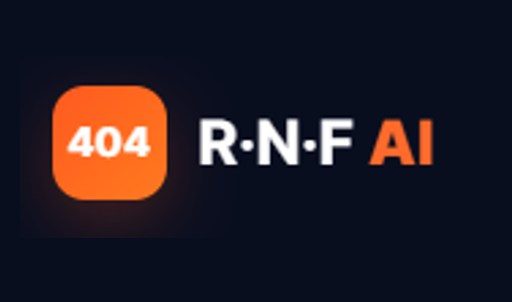
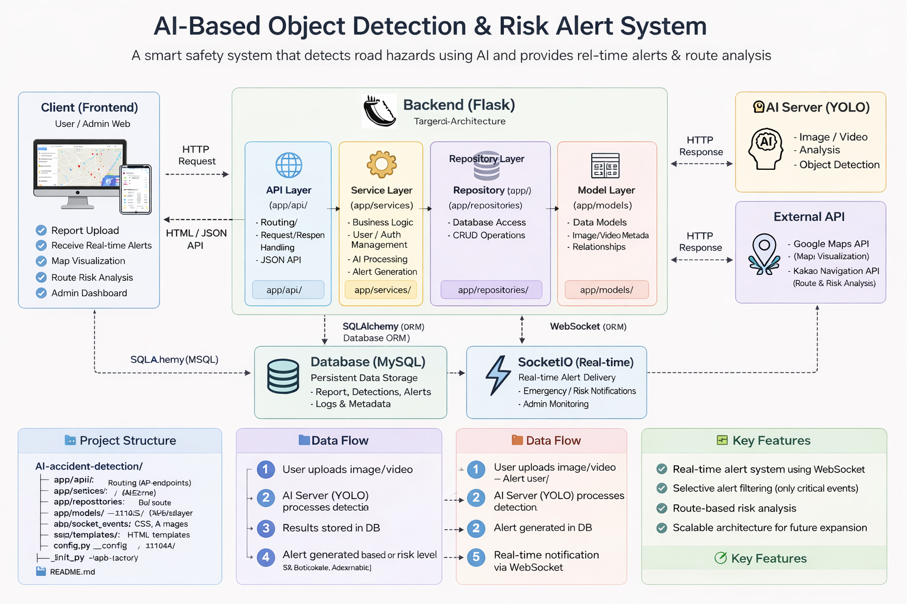

# <p align="center">
  
</p>


AI 기술을 활용해 도로 위 위험 요소를 실시간으로 분석하고,<br>
운전자들이 서로의 경험과 지식을 공유하는 안전 주행 통합 플랫폼

---


### 🚧 AI 기반 낙하물 탐지 및 위험 알림 시스템

도로 위 낙하물을 AI로 탐지하고<br>
실시간 알림 + 경로 기반 위험 분석을 제공하는 스마트 안전 서비스

---

### 📌 프로젝트 개요

이 프로젝트는 도로 위 낙하물을 AI로 자동 탐지하고,
그 결과를 기반으로 위험도를 판단하여 실시간 알림을 제공하는 시스템입니다.

또한 지도 기반으로 위험 지역을 시각화하고,
사용자의 이동 경로 내 위험 요소를 분석하여 사전 대응이 가능하도록 설계되었습니다.

---


### ✨ 주요 기능
🧠 AI 낙하물 탐지
- YOLO 기반 객체 탐지
- 이미지 / 영상 업로드 시 자동 분석
- 낙석, 박스, 타이어 등 객체 분류

### 🚨 실시간 위험 알림
- 위험/긴급 상황만 필터링하여 알림 생성
- Flask-SocketIO 기반 실시간 전송

### 🗺️ 실시간 위험 모니터링
- 지도 기반 위험 위치 시각화
- 최신 위험 객체 리스트 제공

### 🧭 경로 기반 위험 분석
- 출발지 / 도착지 입력
- 경로 내 위험 요소 분석

### 🛠️ 관리자 기능
- 신고 관리 및 상태 처리
- 실시간 알림 관리
- 지역별 위험도 분석
- AI 분석비교

---

### 🏗️ 시스템 아키텍처
#### Backend Layer 구조

**< 계층 :	역할 >**
- API	 :   요청 처리
- Service	  :    비즈니스 로직
- Repository	 :    DB 접근
- Model	:    데이터 구조

---

### 👨‍💻 팀 구성
```
이름	  /  역할  /   담당 기능
김도하	조장	   /  DB 테이블 설계, 전반적인 프레임워크 총괄 구성, AI 모델 개발
송명근	부조장  /  관리자 페이지, 신고 기능, 지도 API 연동 / AI 개발
임효정	조원	  /  마이페이지, UI 스타일링, 데이터 수집
김도균	조원	 /  웹소켓, 실시간 알림, 탐지 현황, 위험도 분석
```


### 📂 프로젝트 구조
```
AI-accident-detection/
├── app/
│   ├── api/              # 라우터 (URL 요청 처리)
│   ├── services/         # 비즈니스 로직
│   ├── repositories/     # DB 접근 계층
│   ├── models/           # 데이터 모델 (ORM)
│   ├── socket_events/    # 실시간 알림 소켓 이벤트
│   ├── static/           # CSS, JS, 이미지, 사운드
│   ├── templates/        # HTML 템플릿 (Jinja2)
│   ├── common/           # 공통 유틸 (데코레이터, 응답 등)
│   ├── config.py         # 환경설정 (.env)
│   ├── extensions.py     # DB, SocketIO 초기화
│   └── __init__.py       # 앱 생성 및 블루프린트 등록
│
├── migrations/           # DB 마이그레이션 (Alembic)
│   ├── versions/         # 테이블 변경 이력 관리
│   ├── env.py            # 마이그레이션 환경 설정
│   └── alembic.ini       # Alembic 설정 파일
│
├── run.py                # 서버 실행 파일
└── README.md
```

**< 레이어 별 책임 >**
- app/api: 클라이언트 요청을 처리하는 라우터
- app/services: 핵심 비즈니스 로직 처리
- app/repositories: 데이터베이스 쿼리 관리
- app/models: DB 테이블 구조 정의
- app/socket_events: 실시간 알림 이벤트 처리
- migrations: DB 스키마 변경 이력 관리 (Alembic)

---

### 🏗️ 시스템 아키텍처
본 시스템은 AI 기반 객체 탐지부터 실시간 알림, 사용자 서비스까지<br>
유기적으로 연결된 구조로 설계되었습니다.




### ⚙️ 핵심 기술 스택

**🖥️ Backend**
- Flask
- SQLAlchemy
- Flask-Migrate (DB Migration 관리)
- Flask-SocketIO (실시간 통신)

**🌐 Frontend**
- HTML / CSS / JavaScript
- Google Maps API (지도 시각화)
- Kakao Navigation API (경로 탐색 및 위험 분석)


## 🤖 AI
### 1. 객체 탐지 (Object Detection)

| 모델 | Optimizer | 역할 |
|------|----------|------|
| YOLOv8 | SGD | 낙하물 객체 탐지 (기본 모델) |
| YOLOv8-p2 | SGD | 소형 객체 탐지 성능 향상 |
| RT-DETR | AdamW | Transformer 기반 객체 탐지 |


### 2. 텍스트 생성 (LLM)

- LLM 기반 자동 문장 생성
  - 신고 제목 자동 생성
  - 신고 내용 자동 보조 작성
- 사용자 입력을 보완하여 신고 작성 편의성 향상

객체 탐지 모델(YOLOv8, RT-DETR)과 LLM을 결합하여  
탐지 → 분석 → 사용자 입력 보조까지 이어지는 AI 파이프라인을 구축

### 🗄️ Database
- MySQL


### 📋 담당 기능 및 대표적인 담당 모듈

**김도하 · 조장**
| 담당 기능 | 설명 | 관련 모듈 |
|----------|------|----------|
| DB 테이블 설계 | 전체 데이터 구조 및 테이블 관계 설계 | `app/models/`, `migrations/` |
| 전반적인 프레임워크 구성 | Flask 앱 초기화, 블루프린트 등록, 공통 구조 설계 | `app/__init__.py`, `app/config.py`, `app/extensions.py` 기반 전체 구조 |
| AI 모델 개발 | 객체 탐지 모델 학습 및 비교, AI 기능 전반 설계 | `app/services/admin_ai_compare_service.py`, `app/repositories/ai_compare_repository.py`, AI 모델 |
| 시스템 총괄 및 통합 | 대부분의 전체 모듈 설계 및 통합 관리 | 프로젝트 전체 구조 설계 및 규칙 정의 |


**송명근 · 부조장**
| 담당 기능 | 설명 | 관련 모듈 |
|----------|------|----------|
| 관리자 페이지 기능 | 관리자 대시보드, 신고 관리, 사용자 관리 기능 구현 | `app/api/admin_routes.py`, `app/api/admin_report_routes.py`, `app/api/admin_user_routes.py`, `app/services/admin_service.py`, `app/services/admin_report_service.py`, `app/services/admin_user_service.py` |
| 신고 기능 | 신고 등록, 파일 업로드, AI 분석 연계 처리 | `app/api/report_route.py`, `app/services/report_service.py`, `app/repositories/report_repository.py` |
| 지도 API 연동 (Google Maps) | 지도 시각화 및 위치 기반 데이터 표시 | `app/templates/main/realtime_monitor.html`, `app/static/js/realtime_monitor.js` |
| AI 개발 | AI 탐지 기능 개발 및 서비스 연계 | `app/services/yolo_service.py`, `app/services/llm_service.py` |

**김도균 · 조원**
| 담당 기능 | 설명 | 관련 모듈 |
|----------|------|----------|
| 웹소켓 | Flask-SocketIO 기반 실시간 통신 처리 | `app/extensions.py`, `app/socket_events/admin_realtime_alert_socket.py` |
| 실시간 알림 기능 | 위험/긴급 상황 발생 시 알림 생성 및 관리자 화면 전송 | `app/api/admin_realtime_alert_routes.py`, `app/services/realtime_alert_service.py`, `app/repositories/realtime_alert_repository.py` |
| 탐지 현황 기능 | 지도 기반 위험 위치, 리스트, 상세 정보 시각화 | `app/api/realtime_monitor_routes.py`, `app/services/realtime_monitor_service.py`, `app/repositories/realtime_monitor_repository.py`, `app/templates/main/realtime_monitor.html`, `app/static/js/realtime_monitor.js` |
| 위험도 분석 기능 | 지역별 위험 통계 및 경로 기반 위험 분석 기능 구현 | `app/api/admin_region_analysis_routes.py`, `app/services/admin_region_analysis_service.py`, `app/repositories/admin_region_analysis_repository.py` |
| Kakao Navigation API 연동 | 경로 탐색 및 경로 기반 위험 분석 기능 구현 | `app/api/kakao_navigation_routes.py` |

**효정 · 조원**
| 담당 기능 | 설명 | 관련 모듈 |
|----------|------|----------|
| 내 정보 보기 기능 | 사용자 마이페이지, 프로필 조회 및 수정 기능 구현 | `app/api/auth_routes.py`, `app/services/auth_service.py`, `app/templates/auth/` |
| UI 스타일링 개선 | 사용자 및 관리자 화면 전반 UI/UX 개선 | `app/static/css/`, `app/templates/` |
| 데이터 수집 | AI 학습 및 기능 검증을 위한 데이터 수집 및 정리 | AI 학습 데이터셋 |

프로젝트는 역할 기반으로 기능을 분담하고, 모듈 단위로 설계하여 협업 효율과 유지보수성을 고려하였습니다.


### 🔄 시스템 동작 흐름
```
[사용자 업로드]
↓
[AI 객체 탐지 수행 (YOLO / RT-DETR)]
↓
[탐지 결과 저장 (Detection)]
↓
[위험도 분석 (주의 / 위험 / 긴급)]
↓
[위험/긴급 시 Alert 생성]
↓
[WebSocket으로 관리자에게 실시간 전송]
↓
[지도 기반 탐지 현황 및 경로 위험 분석 반영]
```


### 📋 기능 명세

| 기능 | 설명 |
|------|------|
| AI 낙하물 탐지 | 이미지/영상 업로드 시 객체 탐지 수행 |
| 위험도 분석 | 탐지 결과 기반 위험도 자동 분류 |
| 실시간 알림 | 위험/긴급 상황 발생 시 관리자에게 실시간 전송 |
| 탐지 현황 | 지도 기반 위험 위치 및 상세 정보 제공 |
| 경로 위험 분석 | 사용자 이동 경로 내 위험 요소 분석 |
| 신고 기능 | 사용자 신고 등록 및 AI 분석 연계 |
| 관리자 기능 | 신고 관리 및 위험 데이터 통계 분석 |
| LLM 자동 생성 | 신고 제목 및 내용 자동 생성 |


### 📈 향후 확장 가능성

- 스마트 시티 안전 관리 플랫폼으로 확장
- 건설 현장 낙하물 관리 시스템 적용
- 자율주행 차량 위험 데이터 연동


